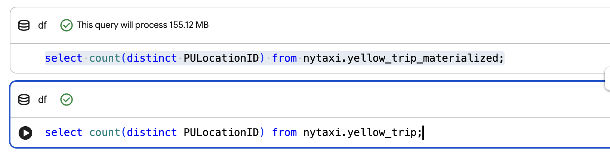
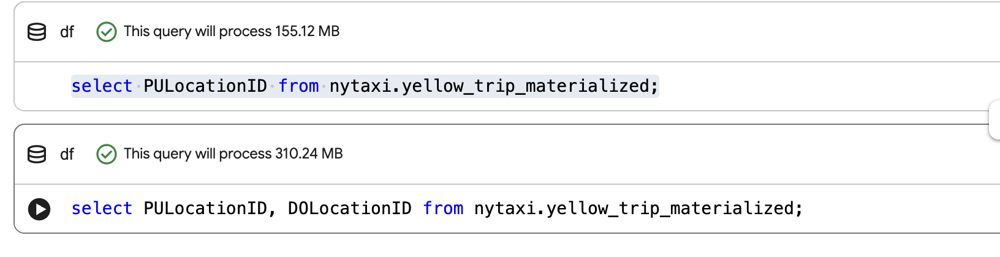
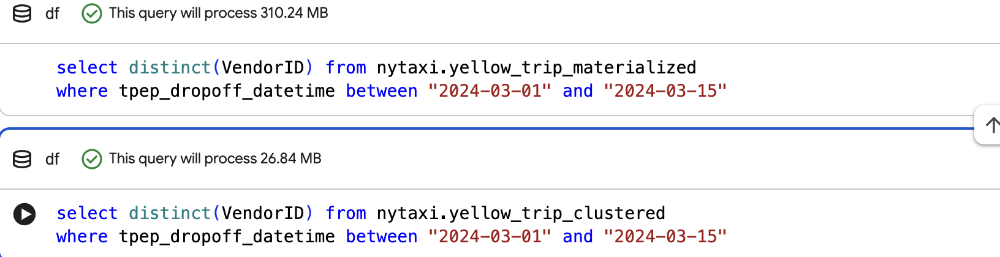

### Question 1. Counting records

```
SELECT COUNT(*) AS trips
FROM `zoomcamp-de-2026-486806.nytaxi.yellow_trip`
```

option 3: 20332093
========================
### Question 2. Data read estimation
```
select count(distinct PULocationID) from nytaxi.yellow_trip_materialized;
select count(distinct PULocationID) from nytaxi.yellow_trip;
```

The estimation is only visible for the materialized table:

option 2: `This query will process 155.12 MB`


========================
### Question 3. Understanding columnar storage
```
select PULocationID from nytaxi.yellow_trip_materialized;
select PULocationID, DOLocationID from nytaxi.yellow_trip_materialized;
```

option 1: BigQuery is a columnar database, and it only scans the specific columns requested in the query. Querying two columns (PULocationID, DOLocationID) requires reading more data than querying one column (PULocationID), leading to a higher estimated number of bytes processed.

========================

### Question 4. Counting zero fare trips
```
select count(*) from nytaxi.yellow_trip_materialized
where fare_amount = 0;
```
option 4: 8333

========================

### Question 5. Partitioning and clustering
```
create or replace table nytaxi.yellow_trip_clustered
partition by DATE(tpep_dropoff_datetime)
cluster by VendorID
as select * from nytaxi.yellow_trip;
```
option 1: Partition by tpep_dropoff_datetime and Cluster on VendorID

========================

### Question 6. Partition benefits
```
select distinct(VendorID) from nytaxi.yellow_trip_materialized
where tpep_dropoff_datetime between "2024-03-01" and "2024-03-15"

select distinct(VendorID) from nytaxi.yellow_trip_clustered
where tpep_dropoff_datetime between "2024-03-01" and "2024-03-15"
```



option 2: 310.24 MB for non-partitioned table and 26.84 MB for the partitioned table

========================

### Question 7. External table storage

data stored in GCP Bucket for the External Table 

option 3: GCP Bucket
========================

### Question 8. Clustering best practices

Clustering is suggested on the known patterns for frequent filtering. Clustering on small data can become overhead decreasing the performance

option 2: False
========================

### Question 9. Understanding table scans

This query will process 0 B when run.

Big Query can get the row count from the metadata since this is a native table and we are not using any filtering to force scanning the data